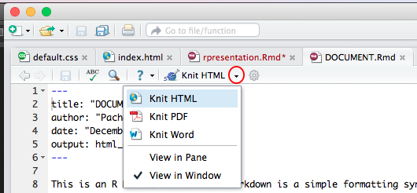
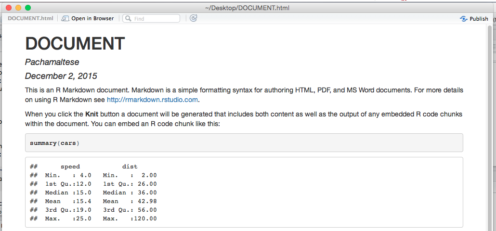
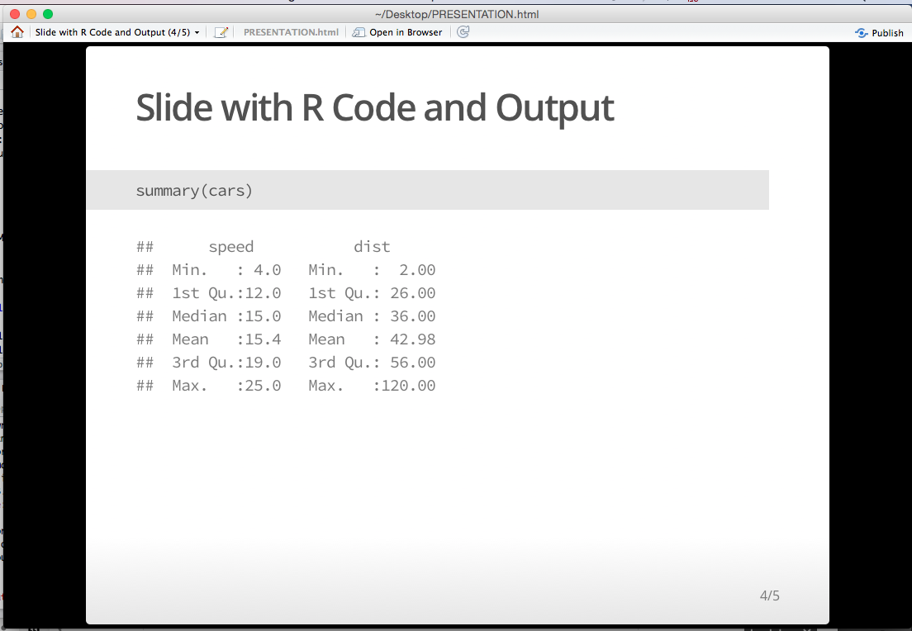

```{r setup, cache = FALSE, echo = FALSE, message = FALSE, warning = FALSE, tidy = FALSE}
knitr::opts_chunk$set(message = F, error = F, warning = F, comment = NA, fig.align = 'center', dpi = 100, fig.width=6, fig.height=5, tidy = F, cache.path = '.cache/', fig.path = '../content/rmdtutorial/')
```

##Motivation
Last term I taught Data Analysis at <a href="http://www.unab.cl" target="_blank">UNAB</a> and I had to find a way to combine slides and R code.

##Problem
You can write but you can't run R code from TeXShop or other editor. LaTeX Beamer is a good option but it has that big flaw. In addition, some of my students used to study from their tablets and smartphones and they complained about missing characters when reading pdf presentations.

##Solution
R Markdown allows you to create Rmd documents where you can write text and add both LaTeX and R code with html or pdf output. You can also embed Google Fonts to your presentation and missing characters won't be an issue anymore.

##Building a document/presentation
In RStudio is quite easy and with 2-3 clicks you are ready to go but here I'm presenting some additional steps that will do the magic.

##Basic Steps
Create a new document, edit the content and you are ready to go. The first time you do this RStudio will ask you to download some libraries.


After you create your document the first lines are like these:
```{r,eval=FALSE}
---
title: "DOCUMENT"
author: "Pachamaltese"
date: "December 2, 2015"
output: html_document
---
```

To insert LaTeX equations just use $ (e.g. `$a+b$`=$a+b$) and to insert R code click "chunks"


R Markdown chunks contain options 

* `eval = TRUE/FALSE` to run (do not run) code
* `echo = TRUE/FALSE` to display/hide the involved code

Here is an example. I show you the result and the code using `eval=FALSE`.

###Using `echo=TRUE`
```{r, eval=FALSE}
{r, echo=TRUE}
plot(cars)
```

Results in
```{r plot-1, echo=TRUE}
plot(cars)
```

###Using `echo=FALSE`
```{r, eval=FALSE}
{r, echo=FALSE}
plot(cars)
```

Results in

```{r plot-2, echo=FALSE}
plot(cars)
```

To obtain the output click on Knit HTML (or Knit PDF) 




What you'll obtain will be something like this





###Adjusting images
Figure width and height can be configured as you wish. For example
```{r, eval=FALSE, fig.height=3, fig.width=4}
{r, echo=FALSE, fig.height=3, fig.width=4}
plot(cars)
```

```{r plot-3, echo=FALSE, fig.height=3, fig.width=4}
plot(cars)
```

###Creating lightweight documents
If you want your html file to be as light as possible one option is to use `vignette_html`. To to that you need to modify the first lines of your Rmd file like this:
```{r, eval=FALSE}
---
title: "DOCUMENT"
author: "Pachamaltese"
output: 
      rmarkdown::html_vignette:
---
```

###Creating customized presentations
I saw a good design from the excellent <a href="https://www.coursera.org/course/regmods">Regression Models</a> unit on Coursera by <a href="https://twitter.com/bcaffo">Brian Caffo</a> and team. I adapted that design allowing several authors and more customization to produce my <a href="http://pachamaltese.github.io/analisis-de-datos-unab/" target="_blank">course material</a> (the Rmd and style files are available <a href="https://github.com/pachamaltese/analisis-de-datos-unab" target="_blank">here</a>). To obtain the same result you need to change the first lines of your Rmd file like this:
```{r, eval=FALSE}
---
title: "PRESENTATION"
author: "AUTHOR 1"
hitheme: tomorrow
framework: io2012
knit : slidify::knit2slides
---
```

###Further reading

* <a href="http://yihui.name/knitr/">Knitr</a> - chunks options
* <a href="http://slidify.org" target="_blank">Slidify</a> - changing styles and animations
